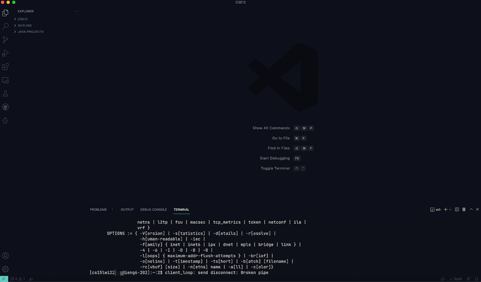

# CSE Lab1 Report

## <strong>Step 1: Install VS Code</strong> 
  To install VS Code, please visit https://code.visualstudio.com/ and select your platform. VS Code supports major platforms such as Windows, macOS, and Linux.  
  
  

This page usually will automatically identify your platform, just simply click download Stable Build and install it on your computer as usual.  

After installing VS Code, launching it you'll see something like this:  
  

  

## <strong>Step 2: Remotely Connecting</strong> 
University provides specific course accounts for students. For this step, we'll use a command which calls <strong>ssh</strong>  

For Windows:  
Before we get started, you need to install OpenSSH to connect your server or other computers. To install OpenSSH, please visit [Microsoft Documentation website](https://docs.microsoft.com/en-us/windows-server/administration/openssh/openssh_install_firstuse) and follow this instruction to install it.  
  
  For macOS/Linux:  
  Since macOS and Linux are Unix-based operating systems, they have ssh integration built-in, so you don't need to do any extra steps. 
  
  Check your own course-specific account for CSE15L：  
  [Click me to get your account](https://sdacs.ucsd.edu/~icc/index.php)  

  First, open your terminal in VS Code and input command like this.  
  Replacing the Mosaic part with the letters with your account.   
    
    
    

  Enter your password and login you will see something like this:  
    
    

  Now, you have successfully connected to your remote server.  
    
## <strong>Step 3: Trying Some Commands</strong>   
Let's try to run some useful commands.  

<strong>*ls*</strong>: Lists all files and directories in the present working directory  
  
  
<strong>*ls - a*</strong>: Lists hidden files as well  
  
  

<strong>*ls -lat*</strong>: List files or directories in a table format with extra information including hidden files or directories:  
  
## <strong>Step 4: Moving Files with scp</strong>   
Alright, since we're able to remote connect the server. Now. it's a good time to learn how to copy files to the server with scp.  

Step 1: Change the directory to the file location on the terminal that you want to copy to the server.  

*cd /your/file/directory*  

Step 2: Use the following command to copy your file to the server.  

*scp WhereAmI.java cs15lwi22zz@ieng6.ucsd.edu:~/*  

Then, you'll be required to the prompted password as usual.  
  
After entering your password, you will successfully move your files to the server.  
## <strong>Step 5: Setting an SSH Key</strong>   
Every time we log in to our server we need to enter a password, which is usually very tedious and some passwords are very cumbersome to set. So, is there a way to log in to the server on your PC without entering a password every time? Let me introduce the SSH Key feature.  

Step 1 (On your computer/client):  
Enter the following command:  
*ssh-keygen*  
You will then see the following screen:  
  

Step 2 (On the server):  
Using ssh connect your server and enter the following command:  

*mkdir .ssh*  
  
  Logout the server and back on client enter following command:  

  *scp /Users/yourusername/.ssh/id_rsa.pub cs15lwi22@ieng6.ucsd.edu:~/.ssh/authorized_keys*  

  Now, you should be able to log in to your server without a password!  
  
    

## <strong>Step 6: Optimizing Remote Running</strong>   
Congratulations, you have completed most of the steps. Now let's learn how to optimize remote running.  
Here are some fun commands you can try:  

*scp Hello.java cs15lwi22zz@ieng6.ucsd.edu:~/*  
If you already have Hello.java on your server, this command will overwrite the contents of Hello.java on in the remote home directory.  

*ssh cs15lwi22@ieng6.ucsd.edu "ls"*  
This command means after connected your server, it will run <strong>*ls*</strong> immediately.  
  

Now, you have completed all the steps. Enjoy!