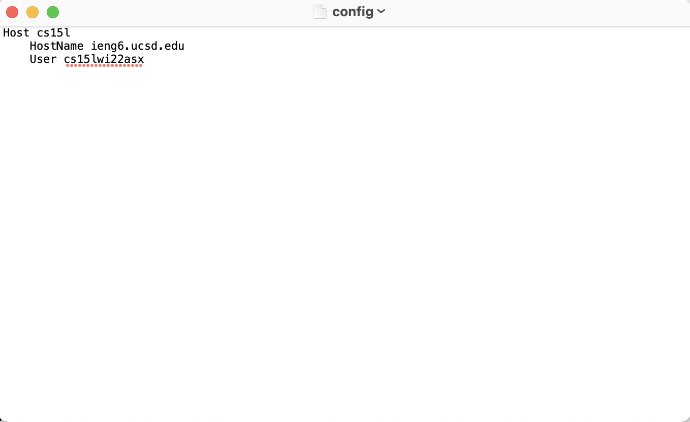
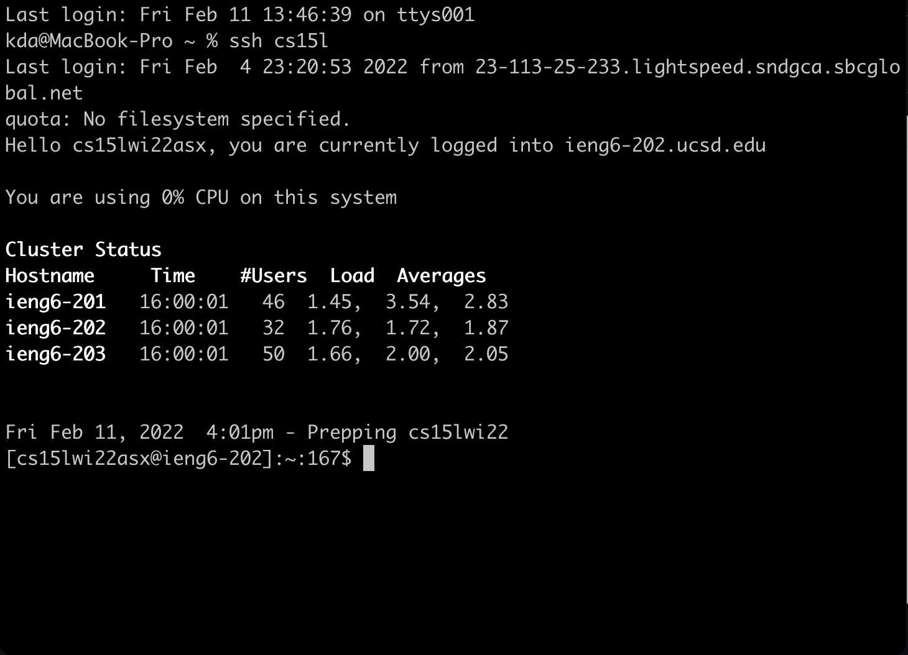
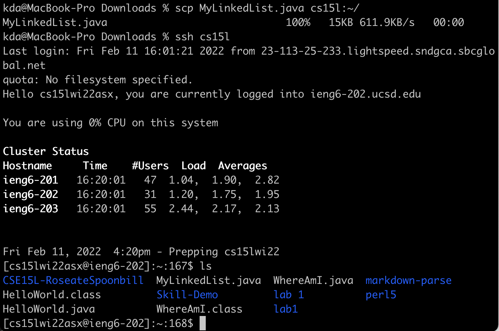

# CSE Lab 3 Report  

# <strong>#Steamlining ssh Configuration</strong>  

## .ssh/config file
  
I edited it in the TextEdit application on Mac, and I named my alias `cs15l` and put my cs15l username as User. 
 

## ssh command
  
In the above image, that shows when I using the alias that I created in the previous step logs me into my server account without input username and password.
 

## scp command
  
I copied my file(MyLinkedList.java) into my server account and using `cs15l` without username and password. Then I logged into my server and checked this file was successfully copied in.
