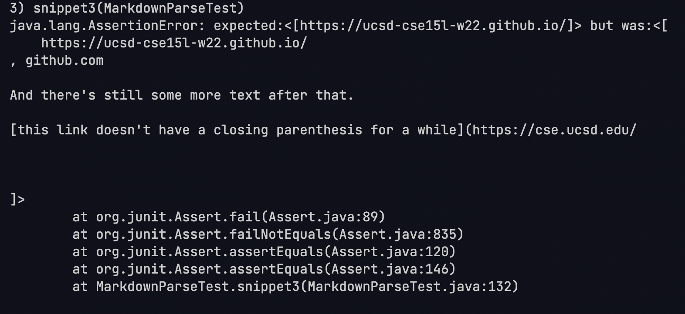

# CSE Lab Report4

## Repo Links:  
[Mine](https://github.com/kdaeve/CSE15L-RoseateSpoonbill)  
[Other Group's](https://github.com/Shree-G/markdown-parse)  

## MarkdownParseTest Snippet Test Code:
```
    @Test
    public void snippet1() throws IOException{
        Path fileName = Path.of("snippet1.md");
	    String contents = Files.readString(fileName);
        ArrayList<String> links = MarkdownParse.getLinks(contents);
        ArrayList<String> expected = new ArrayList<>();
        expected.add("$20google.com");
        expected.add("google.com");
        expected.add("ucsd.edu");
        assertEquals(expected, links);
    }

    @Test
    public void snippet2() throws IOException{
        Path fileName = Path.of("snippet2.md");
	    String contents = Files.readString(fileName);
        ArrayList<String> links = MarkdownParse.getLinks(contents);
        ArrayList<String> expected = new ArrayList<>();
        expected.add("a.com");
        expected.add("a.com(())");
        expected.add("example.com");
        assertEquals(expected, links);
    }

    @Test
    public void snippet3() throws IOException{
        Path fileName = Path.of("snippet3.md");
	    String contents = Files.readString(fileName);
        ArrayList<String> links = MarkdownParse.getLinks(contents);
        ArrayList<String> expected = new ArrayList<>();
        expected.add("https://ucsd-cse15l-w22.github.io/");
        assertEquals(expected, links);
    }
```

## Expected Results:  
- Snippet1:[%60google.com, google.com, ucsd.edu]
    - url.com shouldn't be a link since ``[]`` section has backticks and that shouldn't taken into account as part of the link syntax.
    - $20 is the url-encoding for `` ` ``.
    - Complete code block inside ``[]`` is fine.

- Snippet2:[a.com, a.com(()), example.com]
    - Complete link within ``[]`` is fine.
    - Inside of parentheses ``()`` should be counted as link.
    - ``\`` should be included in the text of the link, not end of ``[]`` link syntax.

- Snippet3:[https://ucsd-cse15l-w22.github.io/]
    - More than one new lines consecutively entered in ``[]``.
    - Single new lines before and after link in ``()`` is fine and should be kept as links.
## Snippet JUnit Fail of My Code  
Snippet 1 JUnitFail:  
  

Snippet 2 JUnitFail: 
 

Snippet 3 JUnitFail: 
 

## Snippet JUnit Fail of Other Group's Code  
Snippet 1 JUnitFail:  
  

Snippet 2 JUnitFail: 
 

Snippet 3 JUnitFail: 
 

## Can the program be fixed in <10 lines?  
### Snippet 1:
- No, not only do we look for the beginning and end of each backtick return that indicates the end of a code section, but we also check for cases where the backticks return is ignored and treated as normal text (i.e., inside the parentheses).
### Snippet 2:
- Yes, this could be done by having a check or making a function to see if there are nested parentheses in the link area.
### Snippet 3:
- No, links become non-links only when multiple newlines are entered in a row of the brackets and the newlines are strictly before and/or after the bracketed text. Our program needs to check that no more than one newline is entered and then trim the extra lines before and after the brackets, but allow newlines between non-blank characters in the bracketed, string, resulting in a large number of if statements.