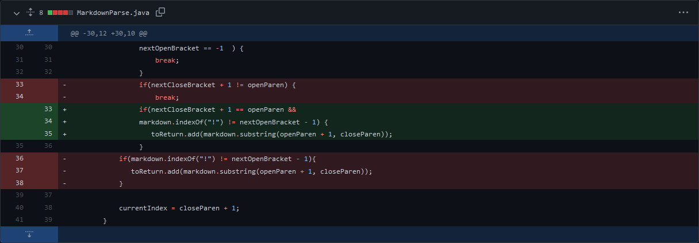

# CSE Lab2 Report

## <strong>First code change</strong><br/>  
  
This is the link for the failure-inducing input [test-file4.md](https://github.com/kdaeve/markdown-parse/blob/main/test-file4.md).  

**Symptoms in running main:** <br /> 
```
kda@MacBook-Pro CSE15L-RoseateSpoonbill % javac MarkdownParse.java 
kda@MacBook-Pro CSE15L-RoseateSpoonbill % java MarkdownParsetest-file4.md  
[43245.jpg, https://something.com]
```  

**Symptoms in JUnit Tester:** <br /> 
```
There was 1 failure:
1) parseTest4(MarkdownParseTest)
java.lang.AssertionError: expected:<[https://something.com]> but was:<[43245.jpg, https://something.com]>
        at org.junit.Assert.fail(Assert.java:89)
        at org.junit.Assert.failNotEquals(Assert.java:835)
        at org.junit.Assert.assertEquals(Assert.java:120)
        at org.junit.Assert.assertEquals(Assert.java:146)
        at MarkdownParseTest.parseTest4(MarkdownParseTest.java:34)

FAILURES!!!
Tests run: 3,  Failures: 1
```  

**Description:** <br /> 
As we noticed in code change, after we running main and Junit test for test-file4.md we failed the test. The image added to our list of links incorrectly. Actually, this bug was causing by our code and we didn't check for a "!" before the bracket, which indicates that the code was inserted an image. Futhermore, this bug leading we failed the JUnit test since the syntax between an image and a link is differentiated by a ! before the opening bracket, and because this was not originally addressed, the image was treated like a link and added to our list.


## <strong>Second code change</strong><br/>  
 
  

This is the link for the failure-inducing input [test-file6.md](https://github.com/kdaeve/CSE15L-RoseateSpoonbill/blob/main/test-file6.md)  

**Symptoms in running main:** <br /> 
```
kda@MacBook-Pro CSE15L-RoseateSpoonbill % javac MarkdownParse.java
kda@MacBook-Pro CSE15L-RoseateSpoonbill % java MarkdownParse test-file6.md
[page.com]
```  
**Symptoms in JUnit Tester:** <br /> 
```
There was 1 failure:
1) parseTest6(MarkdownParseTest)
java.lang.AssertionError: expected:<[]> but was:<[page.com]>
        at org.junit.Assert.fail(Assert.java:89)
        at org.junit.Assert.failNotEquals(Assert.java:835)
        at org.junit.Assert.assertEquals(Assert.java:120)
        at org.junit.Assert.assertEquals(Assert.java:146)
        at MarkdownParseTest.parseTest6(MarkdownParseTest.java:43)

FAILURES!!!
Tests run: 10,  Failures: 1
```  

**Description:** <br /> 
The symptom of this bug is that [page.com] is incorrectly added to the list of links. In test-file6.md, there is the word "paragraph" between the bracket group and the parenthesis group, which means that it should not be classified as a link. The bug in our program is that we did not consider the syntactic structure of the links, because the character after the right parenthesis must be a open parenthesis. 

## <strong>Third code change</strong><br/>  
 

This is the link for the failure-inducing input [test-file6.md](https://github.com/kdaeve/CSE15L-RoseateSpoonbill/blob/main/test-file6.md)  

**Symptoms in running main:** <br /> 
```
kda@MacBook-Pro CSE15L-RoseateSpoonbill % javac MarkdownParse.java
kda@MacBook-Pro CSE15L-RoseateSpoonbill % java MarkdownParse test-file6.md
[page.com]
```  

**Symptoms in JUnit Tester:** <br /> 
```
There was 1 failure:
1) parseTest6edit(MarkdownParseTest)
java.lang.AssertionError: expected:<[aaa.com]> but was:<[]>
        at org.junit.Assert.fail(Assert.java:89)
        at org.junit.Assert.failNotEquals(Assert.java:835)
        at org.junit.Assert.assertEquals(Assert.java:120)
        at org.junit.Assert.assertEquals(Assert.java:146)
        at MarkdownParseTest.parseTest6edit(MarkdownParseTest.java:53)

FAILURES!!!
Tests run: 10,  Failures: 1
```  
**Description:** <br /> 

As we can see, after we running the file at the command line for the version where it was failing that shows "[]" instead of valid link at the end of the file. Because the file has an invalid link before a valid link, our original code had a break; statement that stops our function as soon as it realizes that some part of the code is not syntactically aligned of the link. Thus, the bug stops before the code reaches the end of the file, which means it misses the valid link at the end.